# route-recap 🗺️

Inspired by a recent road trip: after coming back with heaps of geotagged photos
and videos, existing tools didn't offer a clean, fully controlled, native way to
view the whole journey. `route-recap` is a custom solution built to turn raw
travel media into an automated, continuous route map summary.

## 🎯 What it does

Feed it a folder of iPhone travel media (HEIC / JPEG / MOV / MP4) and it:

1. **Extracts** GPS coordinates and capture timestamps from every file
   (ExifTool first, Pillow + `pillow-heif` as an image fallback).
2. **Filters outliers** — photo dumps usually contain noise: home, airport,
   or even foreign-country photos. Waypoints that imply flight-speed jumps
   in the timeline are split off and the largest continuous segment is kept
   as the trip (opt out with `--no-filter-outliers`).
3. **Deduplicates** photo bursts (same viewpoint within ~50 m / 5 min) into
   single waypoints.
4. **Detects stops** — places where you paused long enough to matter
   (default 30 min, or 6 h for overnight stays) — and reverse-geocodes them
   into named landmarks.
5. **Reconstructs the driven route** snapped to real roads using Google
   (Snap to Roads + Routes API) with automatic OSRM fallback when no API key
   is configured. Where Google's road network is incomplete (gravel side
   roads, fjord viewpoints), the unsnapped runs are **bridged via OSRM**
   (OpenStreetMap data) so the route stays continuous; only truly isolated
   points become **off-road POIs** on the map.
6. **Builds a static report** — one `index.html` with the trip data embedded,
   a Leaflet map with the route, numbered stop pins and off-road POIs, plus a
   `summary.json` sidecar. Each trip **day gets its own route color**, the
   legend has day filter buttons, and a **drive animation** plays the whole
   journey with a car whose traveled trail turns gray while the road ahead
   keeps its day color. Trip media is hardlinked into the report folder with
   thumbnails, and stop popups show photo strips linking back to the
   originals. The single HTML file is **shareable and works on mobile** — a
   Share button copies the link and a Download button saves the file. Leaflet
   and the basemap tiles load from the network when you open the report.

## 🔄 How a trip becomes a map

Run the CLI once; it coordinates local media processing, optional map APIs,
and report generation. This flowchart shows the full path, including provider
fallbacks:

```mermaid
flowchart TD
   subgraph input["1 · Select and extract"]
      media["Trip media folder<br/>HEIC · HEIF · JPEG · MOV · MP4"]
      cli["CLI configuration<br/>trip name · folder · units · stop threshold"]
      extract["MediaExtractor<br/>ExifTool; Pillow + pillow-heif image fallback"]
      hasGps{"GPS coordinates found?"}
      skipped["Skip from map<br/>file remains in scanned-file count"]
      gps["GPS coordinates + capture time"]
      media --> cli --> extract --> hasGps
      hasGps -->|No| skipped
      hasGps -->|Yes| gps
   end

   subgraph core["2 · Prepare the trip"]
        filter["Filter outliers<br/>drop flight-speed timeline jumps<br/>(home / airport / foreign photos)"]
        cluster["Sort by capture time<br/>dedupe photo bursts · detect stops"]
        filter --> cluster
    end
    gps --> filter
   subgraph routing["3 · Reconstruct the road route"]
      googleKey{"Google Maps key configured?"}
      snap["Roads API<br/>Snap to Roads"]
      snapOk{"At least 2 waypoints snapped?"}
      routes["Routes API<br/>route snapped on-road points"]
      routeOk{"Google route succeeded?"}
      googleRoute["Google road route<br/>polyline · distance · driving time"]
      offroad["Unsnapped waypoints<br/>separate off-road POIs"]
      osrm["OSRM fallback<br/>uses original waypoint coordinates"]
      osrmRoute["OSRM route<br/>or no route line if routing fails"]
      routeData["Available route segments + metrics"]

      googleKey -->|Yes| snap --> snapOk
      snapOk -->|Yes| routes --> routeOk
      routeOk -->|Yes| googleRoute
      routeOk -->|Yes| offroad
      routeOk -->|No| osrm
      snapOk -->|No / error| osrm
      googleKey -->|No| osrm
      osrm --> osrmRoute
      googleRoute --> routeData
      osrmRoute --> routeData
   end
   cluster --> googleKey

   subgraph report["4 · Name stops and generate the report"]
      geocodeChoice{"Stops found and geocoding enabled?"}
      geocode["Google Geocoding<br/>Nominatim fallback"]
      coordinates["Keep stop coordinates"]
      summary["TripSummary<br/>distance · drive/stop time · media · stops"]
      builder["Jinja2 HTML generator<br/>embeds trip data in the page"]
      files["output/<trip>/index.html<br/>and summary.json"]

      geocodeChoice -->|Yes| geocode
      geocodeChoice -->|No| coordinates
      geocode --> summary
      coordinates --> summary
      summary --> builder --> files
   end
   cluster --> geocodeChoice
   routeData --> summary
   offroad --> summary

   subgraph browser["5 · View the trip"]
      open["Open the HTML report"]
      leaflet["Leaflet map<br/>library loaded from CDN"]
      tileChoice{"CARTO key configured?"}
      carto["CARTO Voyager tiles"]
      osm["OpenStreetMap tile fallback"]
      open --> leaflet --> tileChoice
      tileChoice -->|Yes| carto
      tileChoice -->|No| osm
   end
   files --> open

   classDef local fill:#eaf2ff,stroke:#3973b9,color:#10243e
   classDef decision fill:#fff4dc,stroke:#c78218,color:#3e2d00
   classDef external fill:#f1eaff,stroke:#8062ad,color:#25143d
   classDef output fill:#e8f7ee,stroke:#39875a,color:#13321f
    class media,cli,extract,gps,filter,cluster,summary,builder local
   class hasGps,googleKey,snapOk,routeOk,geocodeChoice,tileChoice decision
   class snap,routes,geocode,osrm,carto,osm,leaflet external
   class skipped,offroad,googleRoute,osrmRoute,routeData,coordinates,files,open output
```



### What each package does

| Package | Responsibility |
|---|---|
| `packages/cli` | Collects trip settings, runs the pipeline, shows progress and opens the report. |
| `packages/core` | Defines the data models; extracts media metadata; filters out foreign/airport outliers; deduplicates waypoints; detects stops; routes, reverse-geocodes, and tags route segments with their trip day. |
| `packages/generator` | Turns the final trip summary into `index.html` and `summary.json` — day-colored routes, day filter legend, drive animation, and sharing; stages media hardlinks and thumbnails. |

**Routing detail:** when Google routing succeeds, road-snapped waypoints form
the road route. Consecutive waypoints Google cannot snap (roads it lacks in
remote areas) are bridged via OSRM so the route stays continuous; only
isolated single points become off-road POIs. If the Google key is absent or
the Google route fails, OSRM is used for the whole route. If routing is
unavailable, the report can still be generated without a route line.

**Keys and network:** `GOOGLE_MAPS_API_KEY` is used by the local pipeline and
is not put in the HTML. `CARTO_BASEMAP_KEY` is embedded in the report because
the browser needs it to request CARTO tiles; without it, the report uses
OpenStreetMap tiles. Trip data is embedded, but the map library and tile images
are remote, so opening the interactive map requires an internet connection.

**Scale:** the pipeline is linear and cheap — thousands of media files and
hundreds of stops are fine. With a Google key, stops reverse-geocode in
parallel (a few seconds for hundreds of stops); the Nominatim fallback runs
sequentially at its ~1 request/second policy limit. Stop pins and POI markers
are marker-clustered on the map, so the report stays readable with hundreds of
stops.

## 🌈 Day colors, animation & sharing

**Color-coded routes by day.** After routing, `clustering.assign_days` tags
every `RouteSegment` with the 0-based day it belongs to (derived from its
start waypoint's timestamp, so an overnight leg stays on the day it set off).
The report renders each segment in that day's color from a curated 12-color
palette (trips longer than 12 days cycle), and the legend lists one toggle per
day so you can show or hide individual days.

**Day-aware animation.** The play/speed/slider controls drive a car along the
route. The traveled trail is grayed out behind the car while the road ahead
stays in its day color, so the line visibly changes color as you cross into a
new day; the label's `Day N` chip is tinted with that day's color too.
Toggling a day off removes its segments from the animation timeline, and the
car teleports across the hidden days instead of driving a straight line.

**Share anywhere.** The report is a self-contained HTML file — no server, no
setup, and it works offline for the data (tiles and the Leaflet library are
the only network requests). The header has a **Share** button that copies the
report link and a **Download** button that saves the HTML. On touch devices,
swipe up/down on the map to change animation speed and tap the progress label
to play/pause.

```
route-recap/
├── packages/
│   ├── core/                  # route_recap.core — EXIF extraction, clustering, routing
│   │   ├── src/route_recap/core/
│   │   │   ├── extractor.py   # GPS & timestamps from HEIC/JPEG/MOV/MP4
│   │   │   ├── clustering.py  # burst dedup, stop detection, haversine
│   │   │   ├── router.py      # Google Routes/Snap-to-Roads + OSRM fallback, geocoding
│   │   │   └── models.py      # Pydantic schemas (MediaMetadata, Waypoint, Stop, …)
│   │   └── tests/
│   ├── generator/             # route_recap.generator — static HTML report
│   │   └── src/route_recap/generator/
│   │       ├── html_builder.py
│   │       └── templates/map.html.j2
│   └── cli/                   # route_recap.cli — interactive Typer/rich runner
│       └── src/route_recap/cli/main.py
├── data/                      # drop your trip media here (git-ignored)
├── output/                    # generated reports (git-ignored)
├── docs/                      # setup guides
├── pyproject.toml             # uv workspace root
└── requirements.txt           # pip-installable snapshot (generated by uv export)
```

## 🚀 Setup

Requires **Python ≥ 3.12** and [**uv**](https://docs.astral.sh/uv/).

```powershell
# 1. Install everything (one shared .venv, all packages installed editable)
uv sync --all-packages

# 2. Install ExifTool (video metadata; Pillow covers images only)
winget install OliverBetz.ExifTool
#    see docs/setup_exiftool.md for choco / scoop / manual options
exiftool -ver

# 3. Optional: configure a Google Maps Platform API key
Copy-Item .env.example .env   # then edit .env and add GOOGLE_MAPS_API_KEY

# 4. Optional: ffmpeg for video preview frames in map popups
winget install Gyan.FFmpeg
```

## 🗺️ Usage

```powershell
# Interactive: prompts for trip name, folder, units, stop threshold
uv run route-recap

# Non-interactive: all defaults except the input folder
uv run route-recap --input-dir "C:\Photos\iceland-2026" --name "Iceland Ring Road 2026" --unit km

# Keep waypoints from a different trip (home/airport/foreign photos)
uv run route-recap --no-filter-outliers

# Skip media staging/thumbnails
uv run route-recap --no-media

# See all options
uv run route-recap --help
```

Output lands in `output/<trip-name>/index.html` (plus a `summary.json`
sidecar). Trip media is hardlinked into `output/<trip-name>/media/` with
thumbnails in `thumbs/` (no extra disk space, no copies).

To view the photos in the map popups, serve the reports over HTTP —
browsers block `file://` pages from loading `file://` images:

```powershell
uv run route-recap serve            # serves output/ at http://127.0.0.1:8000
uv run route-recap serve --port 9000 --no-open
```

The trip data is embedded, while Leaflet, map tiles, and photo strips are
fetched through the local server.

## ⚙️ Configuration (`.env`)

| Variable               | Purpose                                                            |
| ---------------------- | ------------------------------------------------------------------ |
| `GOOGLE_MAPS_API_KEY`  | Enables Google routing + geocoding (primary provider)              |
| `CARTO_BASEMAP_KEY`    | CARTO Voyager basemap tiles in the HTML report (falls back to OSM) |
| `NOMINATIM_USER_AGENT` | User-Agent for OSM Nominatim geocoding fallback                    |
| `EXIFTOOL_PATH`        | Explicit path to `exiftool.exe` when it isn't on `PATH`            |
| `OSRM_BASE_URL`        | OSRM server used as the routing fallback                           |

**Provider fallback:** with a Google key, on-road waypoints are snapped and
routed with Google Roads and Routes APIs; stop names use Google Geocoding.
Unsnapped waypoints become separate POIs. Without a key, routing uses the
public OSRM demo server and stop naming uses Nominatim. Both public fallbacks
are rate-limited; OSRM does not identify off-road POIs.

## 🧪 Development

```powershell
uv run pytest          # unit tests for models, clustering, router
uv run --with piexif python scripts/make_sample_media.py   # synthetic fixtures in data/sample/
```

## 🔮 Roadmap

- **Stay & Stop Detection:** identify lodging and rest stops (shipped in v0.1)
- **LLM Layer:** parse key highlight photos and generate trip journals / leg summaries
- **Native Interface:** media retrieval shipped in v0.1 — hardlinked originals,
  thumbnails, popup photo strips, and `route-recap serve`. A full-res media
  explorer UI remains on the roadmap.
