# route-recap — Technical Guide

How the pipeline actually works: the stages, the algorithms, the fallbacks, and
the internals of the generated report. This is the contributor-facing companion
to the [README](../README.md), which stays focused on setup and usage.

**Contents**

1. [Pipeline overview](#1-pipeline-overview)
2. [Package layout](#2-package-layout)
3. [Stage-by-stage detail](#3-stage-by-stage-detail)
4. [Data model](#4-data-model)
5. [Report internals (frontend)](#5-report-internals-frontend)
6. [Single-file export](#6-single-file-export)
7. [Serving the report](#7-serving-the-report)
8. [Configuration & providers](#8-configuration--providers)
9. [Performance & scale](#9-performance--scale)
10. [Known limitations](#10-known-limitations)

---

## 1. Pipeline overview

The CLI runs one pass: extract media metadata → clean up the point set →
reconstruct the road route → name stops → render a static report.

```mermaid
flowchart TD
   subgraph input["1 · Select and extract"]
      media["Trip media folder<br/>HEIC · HEIF · JPEG · MOV · MP4"]
      cli["CLI configuration<br/>trip name · folder · units · stop threshold"]
      extract["MediaExtractor<br/>ExifTool; Pillow + pillow-heif image fallback"]
      hasGps{"GPS coordinates found?"}
      skipped["Skip from map<br/>file remains in scanned-file count"]
      gps["GPS coordinates + capture time"]
      media --> cli --> extract --> hasGps
      hasGps -->|No| skipped
      hasGps -->|Yes| gps
   end

   subgraph core["2 · Prepare the trip"]
        filter["Filter outliers<br/>drop flight-speed timeline jumps<br/>(home / airport / foreign photos)"]
        cluster["Sort by capture time<br/>dedupe photo bursts · detect stops"]
        filter --> cluster
    end
    gps --> filter
   subgraph routing["3 · Reconstruct the road route"]
      googleKey{"Google Maps key configured?"}
      snap["Roads API<br/>Snap to Roads"]
      snapOk{"At least 2 waypoints snapped?"}
      routes["Routes API<br/>route snapped on-road points"]
      routeOk{"Google route succeeded?"}
      googleRoute["Google road route<br/>polyline · distance · driving time"]
      offroad["Unsnapped waypoints<br/>separate off-road POIs"]
      osrm["OSRM fallback<br/>uses original waypoint coordinates"]
      osrmRoute["OSRM route<br/>or no route line if routing fails"]
      routeData["Available route segments + metrics"]

      googleKey -->|Yes| snap --> snapOk
      snapOk -->|Yes| routes --> routeOk
      routeOk -->|Yes| googleRoute
      routeOk -->|Yes| offroad
      routeOk -->|No| osrm
      snapOk -->|No / error| osrm
      googleKey -->|No| osrm
      osrm --> osrmRoute
      googleRoute --> routeData
      osrmRoute --> routeData
   end
   cluster --> googleKey

   subgraph report["4 · Name stops and generate the report"]
      geocodeChoice{"Stops found and geocoding enabled?"}
      geocode["Google Geocoding<br/>Nominatim fallback"]
      coordinates["Keep stop coordinates"]
      summary["TripSummary<br/>distance · drive/stop time · media · stops"]
      builder["Jinja2 HTML generator<br/>embeds trip data in the page"]
      files["output/<trip>/index.html<br/>and summary.json"]

      geocodeChoice -->|Yes| geocode
      geocodeChoice -->|No| coordinates
      geocode --> summary
      coordinates --> summary
      summary --> builder --> files
   end
   cluster --> geocodeChoice
   routeData --> summary
   offroad --> summary

   subgraph browser["5 · View the trip"]
      open["Open the HTML report"]
      leaflet["Leaflet map<br/>library loaded from CDN"]
      tileChoice{"CARTO key configured?"}
      carto["CARTO Voyager tiles"]
      osm["OpenStreetMap tile fallback"]
      open --> leaflet --> tileChoice
      tileChoice -->|Yes| carto
      tileChoice -->|No| osm
   end
   files --> open

   classDef local fill:#eaf2ff,stroke:#3973b9,color:#10243e
   classDef decision fill:#fff4dc,stroke:#c78218,color:#3e2d00
   classDef external fill:#f1eaff,stroke:#8062ad,color:#25143d
   classDef output fill:#e8f7ee,stroke:#39875a,color:#13321f
    class media,cli,extract,gps,filter,cluster,summary,builder local
   class hasGps,googleKey,snapOk,routeOk,geocodeChoice,tileChoice decision
   class snap,routes,geocode,osrm,carto,osm,leaflet external
   class skipped,offroad,googleRoute,osrmRoute,routeData,coordinates,files,open output
```



Note that steps 1–4 happen **once, locally**. The report it produces is static:
the browser never talks to your machine again, only to the CDN (Leaflet) and the
tile server.

---

## 2. Package layout

`uv` workspace monorepo with three packages sharing one `.venv` and a
`route_recap.*` namespace.

| Package         | Responsibility |
| --------------- | -------------- |
| `packages/cli`  | Collects trip settings, runs the pipeline, shows progress, serves reports. |
| `packages/core` | Data models; media metadata extraction; outlier filtering; deduplication; stop detection; routing; reverse geocoding; day assignment. |
| `packages/generator` | Renders `index.html` + `summary.json` (day colors, legend, animation, share); stages media hardlinks and thumbnails. |

```
route-recap/
├── packages/
│   ├── core/                  # route_recap.core — EXIF extraction, clustering, routing
│   │   ├── src/route_recap/core/
│   │   │   ├── extractor.py   # GPS & timestamps from HEIC/JPEG/MOV/MP4
│   │   │   ├── clustering.py  # burst dedup, stop detection, day assignment, haversine
│   │   │   ├── router.py      # Google Routes/Snap-to-Roads + OSRM fallback, geocoding
│   │   │   └── models.py      # Pydantic schemas (MediaMetadata, Waypoint, Stop, …)
│   │   └── tests/
│   ├── generator/             # route_recap.generator — static HTML report
│   │   ├── src/route_recap/generator/
│   │   │   ├── html_builder.py
│   │   │   ├── media_assets.py
│   │   │   └── templates/map.html.j2
│   │   └── tests/
│   └── cli/                   # route_recap.cli — interactive Typer/rich runner
│       ├── src/route_recap/cli/main.py
│       └── tests/
├── data/                      # drop your trip media here (git-ignored)
├── output/                    # generated reports (git-ignored)
├── docs/                      # setup guides + this document
├── pyproject.toml             # uv workspace root
└── requirements.txt           # pip-installable snapshot (generated by uv export)
```

Dependencies point one way: `cli → generator → core`. Cross-package imports
need an explicit `[tool.uv.sources] x = { workspace = true }` entry or sync
fails.

---

## 3. Stage-by-stage detail

### 3.1 Extraction — `core/extractor.py`

`MediaExtractor.extract_files` walks the folder (HEIC/HEIF/JPEG/MOV/MP4 only)
and reads a fixed tag list per file.

- **Primary path: ExifTool** via `pyexiftool`, which handles images *and*
  videos uniformly. Called as
  `et.get_tags(files=str(path), tags=_EXIFTOOL_TAGS)` — the arguments are passed
  by keyword because the positional order is `(files, tags, params)`.
- **Fallback: Pillow + `pillow-heif`, images only.** Videos have no fallback,
  which is why ExifTool being unavailable means all videos are silently
  dropped. The extractor logs a warning once when ExifTool can't start.

Details worth knowing:

- Group prefixes are stripped from returned keys, so
  `Composite:GPSLatitude` → `GPSLatitude`. For iPhone MOVs the GPS comes back
  as a **Composite** decimal pair with no `GPSLatitudeRef`/`GPSLongitudeRef`,
  and the timestamp as `QuickTime:CreateDate`.
- Timestamps are parsed naive-UTC across a list of formats (EXIF
  `%Y:%m:%d %H:%M:%S`, ISO-8601 with `Z`, fractional seconds). `date -d`-style
  variants are not attempted.
- Files with no GPS are still counted in `total_files` but excluded from the
  map, so the summary can say "scanned 4,040, mapped 4,012".

### 3.2 Outlier filtering — `clustering.filter_outliers`

A photo dump usually contains noise: home, airport, or foreign photos from a
different trip. Those appear as impossible jumps in the chronological timeline.

- Build the timeline from timed waypoints; untimed ones can't be classified and
  are always kept.
- Declare a **jump** between consecutive points when the gap is ≥
  `outlier_gap_minutes` (30) **and** the implied speed exceeds
  `outlier_speed_kmh` (180). The speed test is what distinguishes a flight from
  a long overnight stop.
- Jumps split the timeline into segments; the **largest by media count** is
  kept, the rest are returned as excluded and reported as `media_excluded`.
- Disable with `--no-filter-outliers`.

### 3.3 Deduplication — `clustering.deduplicate`

Collapses photo bursts at the same viewpoint so routing APIs aren't fed
hundreds of near-identical points.

- Sort chronologically; walk in order, merging each point into the current
  cluster anchor when it is within `dedup_radius_m` (50 m) **and**
  within `dedup_window_minutes` (5).
- Merging adds `media_count` and appends `source_files`, so the popup photo
  strip still shows every original.

### 3.4 Stop detection — `clustering.detect_stops`

A "stop" is a meaningful pause, not every photo.

- For consecutive waypoints `a → b`, a stop is declared when the gap is ≥
  `min_stop_minutes` (30) **and** either the distance is ≤
  `stop_max_distance_m` (500 m) — you didn't move — **or** the gap is ≥
  `overnight_hours` (6), which catches overnight stays regardless of where the
  next photo was taken.
- The earlier waypoint is flagged `is_stop` with a `stop_index`, and a `Stop`
  record is appended with arrival/departure times, duration, media count and
  the clustered `source_files`.

### 3.5 Routing — `router.compute_route`

Three outcomes, in preference order:

**A. Google (Snap to Roads + Routes API), then hybrid bridging.**
1. `snapToRoads` in batches of 100 (`_GOOGLE_SNAP_BATCH`) returns
   `{original_index: (lat, lon)}`. Points further than ~300 m from a road are
   simply absent — Google drops them.
2. Only **contiguous runs of ≥ 2 snapped points** are routed, each via
   `computeRoutes` in chunks of 25 (`_GOOGLE_ROUTE_WAYPOINTS`). Google never
   routes *across* an unsnapped gap, which is what prevents distance from being
   double-counted later.
3. `RouteResult.snap_map` preserves the snapped coordinates so bridges can
   connect exactly where Google's segments end.

**Hybrid merge (`_hybrid_merge`).** Google lacks some remote roads (gravel
tracks, fjord viewpoints) that OSM has. Each consecutive run of unsnapped
points is bridged via OSRM **including its boundary points** (the last snapped
point before the run and the first after), so the result is continuous and no
overlap is double-counted. The provider is then reported as `google+osrm`.

**Off-road POIs.** Only **isolated single points at the trip boundary** (no
previous or next neighbour to bridge to) stay off-road. Everything interior is
bridged. That's why a real 748-waypoint trip can end up with only ~5 off-road
points, all in one place. If OSRM's bridge call fails, a straight-line
connector polyline is emitted so the route is never visually disjoint.

**B. OSRM only.** Used when there's no Google key or Google failed outright.
`_OSRM_WAYPOINTS` = 100 per request, with retry/backoff (3 attempts, 0.5·2ⁿ s)
because the public demo server is rate-limited and flaky. OSRM cannot classify
road-snapped vs off-road, so `off_road_indices` is always empty here.

**C. No route.** If every provider fails, a `RoutingError` is caught by the CLI
and the report is still generated, just without a route line.

### 3.6 Reverse geocoding — `router.reverse_geocode_detail`

Google Geocoding first (with `address_components`), Nominatim second
(`addressdetails=1`). Both return `{"name", "address"}`.

- The **name** is chosen by a type-preference list, not just the first
  component:
  `_GOOGLE_NAME_TYPES` prefers `establishment` → `point_of_interest` →
  `natural_feature` → `locality` → … → `route`; `_NOMINATIM_NAME_KEYS` prefers
  `tourism` → `attraction` → `amenity` → `village` → `town` → … → `county`.
- The result also carries **`road`** (the `route` component), which is what
  labels mid-drive waypoints — see §3.7.
- **Plus Codes are rejected.** Remote places come back as `9CP22XMR+G9`;
  `_looks_like_plus_code` filters those out of both the name and the road, and
  the address fallback skips them. A point with nothing usable gets no label,
  which the report renders as "On the road" rather than gibberish.
- Nominatim's policy caps usage at ~1 request/second, so that path sleeps 1.1 s
  between stops. The Google path parallelises instead (6 workers,
  `_GEOCODE_WORKERS`).
- API keys are redacted from error text by `_sanitize_message`, because httpx
  embeds the full request URL (including `key=…`) in its exceptions.

### 3.6.1 Naming waypoints — `cli/main.py`

Stops are few, waypoints are many (748 vs 50 on the reference trip), so naming
waypoints needs a different strategy:

- **Proximity reuse.** `_plan_waypoint_queries` groups waypoints within
  `_LABEL_REUSE_M` (750 m) of each other; only the first of each group is
  queried and the rest inherit its label. Waypoints sit every few hundred
  metres and a road name holds for kilometres, so this cuts requests
  dramatically for the same output.
- **Already-labelled points are skipped**, so re-running a trip against an
  existing `summary.json` costs nothing.
- **Nominatim is capped** at `_NOMINATIM_WAYPOINT_CAP` (120) groups, because at
  its ~1 request/second policy naming every waypoint would take many minutes
  and feel broken. The shortfall is reported to the user.
- Waypoint labels prefer the **road** (`wp.road || wp.name`); for an off-road
  spot the **landmark** wins instead, since a road is meaningless there.
- Disable with `--no-waypoint-names`, or `TripConfig.geocode_waypoints`.

Names are persisted into `summary.json`, so a later `build_html` / re-render
reuses them.

### 3.7 Day assignment — `clustering.assign_days`

Runs after routing, before rendering.

- Day 0 is the first calendar day of the trip (earliest waypoint timestamp).
- A segment's day comes from its **start** waypoint's date — so an overnight
  leg stays on the day it set off — falling back to its end waypoint when the
  start is untimed.
- An untimed segment inherits the previous segment's day.
- Returns **new** `RouteSegment` objects with `day_index` set; the input list is
  not mutated. If nothing is timed, every segment gets day 0.

### 3.8 Report generation — `generator/html_builder.py`

Renders `templates/map.html.j2` with Jinja2 and writes `index.html` plus a
`summary.json` sidecar.

- The whole trip is embedded in a single `<script id="trip-data"
  type="application/json">` element. `_json_for_script` escapes `<`, `>` and `&`
  as `\u003c`/`\u003e`/`\u0026` — HTML parsers don't decode entities inside
  `<script>`, so this is what makes the embedded data safe.
- `DAY_PALETTE` (12 distinct colors) and `day_count` go to the template; trips
  longer than 12 days cycle the palette.
- `autoescape` is on for `.html`/`.j2`, so the `trip_json` insertion is marked
  `| safe` deliberately (it is pre-escaped above).

### 3.9 Media staging — `generator/media_assets.py`

`stage_media(sources, output_dir)` makes popup photos work without copying
data.

- Each source is **hardlinked** into `media/0001.ext` (`os.link`), with
  `shutil.copy2` as a cross-device fallback and an unlink-first step so
  re-runs replace stale links. Hardlinks cost no extra disk space.
- Thumbnails are written to `thumbs/0001.jpg`: `ImageOps.exif_transpose`
  (respects phone orientation), resized to `THUMB_SIZE` (320 px), JPEG quality
  82.
- Video thumbnails use `ffmpeg -ss 1 -frames:v 1` and require ffmpeg on PATH;
  without it the video is still staged but has no preview and the report shows
  a ▶ badge instead.
- Returns `{source_path_string: {"url", "thumb", "kind"}}`, keyed **exactly** as
  the strings stored in `Waypoint.source_files`, so the template can look up
  each photo.

---

## 4. Data model

Defined in `core/models.py` (Pydantic). Coordinates are validated to valid
lat/lon ranges on construction.

| Model | Role |
| ----- | ---- |
| `MediaMetadata` | One media file: type, optional GPS/altitude, capture timestamp, camera make/model, size. |
| `Waypoint` | A chronological location; may aggregate several files after dedup. Carries `media_count`, `source_files`, `is_stop`/`stop_index`, `off_road`. |
| `Stop` | A significant pause: coordinates, arrival/departure, duration, media count, clustered `source_files`, geocoded `name`/`address`. |
| `RouteSegment` | One snapped road leg. `start_index`/`end_index` index into the waypoint list; plus encoded polyline, distance, duration, `day_index`. |
| `TripConfig` | Run options and thresholds (see §7). |
| `TripSummary` | The whole result: stats, waypoints, stops, segments. `distance_mi`, `off_road_count`, `day_count` are computed properties. |

Encoded polylines use the standard Google polyline algorithm at precision 5.

---

## 5. Report internals (frontend)

All of this lives in `templates/map.html.j2` — a single file with inlined CSS
and JS, loading Leaflet 1.9 and `leaflet.markercluster` 1.5.3 from unpkg.

### 5.1 Day colors and the legend

`dayColor(day)` indexes `DAY_PALETTE` modulo its length. Each segment is drawn
as two polylines — a white halo (weight 9) under a colored line (weight 5) — so
overlapping days stay distinguishable. `#day-toggles` renders one button per
day; toggling hides that day's polylines and rebuilds the animation.

### 5.2 The animation engine

`buildTrack()` converts route segments into a monotonic `(v, position)` track.

- **Pacing is deliberate and not timestamp-driven.** `v` advances at a constant
  `NOMINAL_KMH` (90) per leg, and a stop becomes a pause capped at
  `MAX_PAUSE_S` (120). Using real elapsed time made the car crawl through long
  overnight gaps then rocket through legs whose photos were seconds apart.
- Every track point carries `realMs` (true trip time) so the clock, `Day` chip,
  `At:` and `Next:` labels stay honest even though the animation pace is
  synthetic. `nextStopInfo` compares against `realMs`, not the animation clock.
- **Hidden days**: skipped entirely; the car *teleports* across them (two track
  points at the same `v`), and `posAt` snaps to the later one.
- **Progressive reveal**: while driving (`playing || current > 0`) the overview
  route is hidden. `routePath` is the deduped driven geometry with a parallel
  `routeDays` array; it's split into contiguous per-day `trailRuns`, and
  `renderTrail(p)` extends each run's polyline only as far as the car has
  reached, tinted with that day's color.
- **Reset** (`⟲`) stops playback, cancels the rAF loop, clears the run
  polylines, restores the overview and resets to 0.
- **Arrows** are placed at an even distance interval over the whole route —
  `ARROW_TARGET` 34 targets, clamped to 3–60 km spacing — rather than per
  segment, which used to bunch them on short legs. Each arrow's rotation is
  baked into the SVG `transform`, so it renders correctly even before the
  marker is painted on screen.
- The car icon is **never rotated**; travel direction is conveyed by the
  arrows.

### 5.3 Marker icons

Waypoints render as 📷 and off-road spots as a larger, glowing 🏔️ via
`L.divIcon`; stops keep numbered pins with a `Stop N · name` tooltip. Markers
are grouped with `markerClusterGroup` (radius 60) and fall back to plain
`addTo(map)` if the plugin fails to load. At low zoom the numbered circles are
**cluster bubbles** (counts of nearby photos), not stop pins — the legend calls
this out.

### 5.4 Dark mode

`html.dark` redefines the CSS custom properties in `:root`. The choice is
persisted in `localStorage['route-recap-theme']`, defaults to
`prefers-color-scheme`, and is applied by a small inline `<head>` script
*before first paint* to avoid a flash of light theme. The basemap is chosen in
JS: CARTO `dark_all` when a CARTO key is configured, otherwise OSM tiles with a
CSS `invert(1) hue-rotate(180deg)` filter to approximate a dark map.

### 5.5 Photos and the lightbox

Popups render a `photo-strip` of thumbnails, limited to 6 (stops), 4 (off-road)
or 3 (waypoints) so a popup stays a reasonable size. Thumbnails are `<button>`s,
not links — clicking one opens an **in-page lightbox**, so the report never
navigates away.

**One gallery for the whole trip.** Rather than a separate viewer per location,
`buildGallery()` assembles a single `allPhotos` array in **trip order** — stops
first (their labels are richer), then every waypoint — deduplicated by source
file, with `photoIndexOf` mapping each file to its index. Each strip therefore
only needs to emit global indices, and the lightbox walks the whole array. That
is what lets a swipe run past the end of one stop straight into the next place
instead of stopping, which is the behaviour that makes browsing feel continuous.

- Each strip renders its first `limit` photos plus a **`+N`** button. The button
  carries the global index of the **first hidden photo** — verified across all
  201 strips on the reference trip — so it drops you exactly where the strip
  left off rather than at the start.
- A caption shows the current photo's place (road, stop name, or landmark) and
  time, and the counter is global (`2077 / 2122`).
- Click handling is delegated on `document` (popups are created by Leaflet long
  after the handlers are registered) and calls `stopPropagation` so the popup
  stays open.
- The lightbox is built lazily on first use: close via the × button, the
  backdrop, or Esc; navigate via the arrow buttons, ← / →, or a horizontal
  swipe. Navigation wraps around. `document.body.style.overflow` is locked
  while it is open, and the `src` is cleared on close so full-resolution images
  are released promptly.
- **Source selection:** `a.url || a.thumb`, with an `onerror` fallback back to
  `thumb`. In the folder report `url` is `media/…`, so the lightbox shows the
  **full-resolution original** (4,284×5,712 on the reference trip) while strips
  stay at 240×320. In a single-file report `url` is empty and it falls back to
  the embedded preview.
- Videos keep an external `▶` link — a video file cannot be embedded, so there
  is nothing to show in the lightbox.

### 5.6 Mobile and sharing

- Swipe up/down on the map changes animation speed; tapping the progress label
  toggles play/pause (both with a toast).
- The **Share** button prefers `navigator.share` (the native iOS share sheet)
  and falls back to the clipboard, then to a hidden-textarea copy. This matters
  because `navigator.clipboard` requires a **secure context** and is
  unavailable on a plain `http://` LAN address.
- CSS uses `viewport-fit=cover` with `env(safe-area-inset-*)`, `100dvh` for the
  collapsing Safari toolbar, and `-webkit-text-size-adjust: 100%`.

---

## 6. Single-file export

`generator/single_file.py` produces `journey.html`: one file that can be sent to
someone and opened straight off the filesystem. It exists because of two hard
browser constraints:

1. A `file://` page **cannot load `file://` images**, so the folder report's
   `media/` and `thumbs/` links break when the folder leaves your machine.
2. Most recipients should not have to run a web server to look at photos.

### What gets inlined

| Content | How |
| --- | --- |
| Trip data | Already embedded as JSON by the normal builder. |
| Leaflet + markercluster (CSS and JS) | Downloaded from unpkg at build time, cached on disk, inlined into `<style>` / `<script>`. The template keeps its CDN `<link>`/`<script>` tags as the fallback. |
| Photos | Re-encoded to ~200 px JPEG (quality 70) and embedded as `data:` URIs. |

Library downloads are cached in `~/.route-recap/vendor` (override with
`ROUTE_RECAP_CACHE`) so repeat runs don't refetch. If a download fails or the
payload contains a tag-terminating `</script>`/`</style>` sequence, that file is
skipped and the template falls back to the CDN link — a partially inlined set
would be worse than none, so the code only inlines when *every* file arrived.

### Photo embedding

- **Budgeted.** `--max-embed-mb` (default 20) caps the total base64 payload.
  Photos are considered in `_ordered_sources` order — **stops first, then
  off-road POIs, then remaining waypoints** — so a truncated file still shows
  the photos a viewer is most likely to open.
- **Sources `thumbs/` when available**, falling back to the original, so the
  multi-gigabyte originals are never re-read. A whole-trip export of 2,122
  photos takes seconds, not minutes.
- **Videos are dropped entirely** rather than embedded — they are far too large,
  and a video with no preview would otherwise render a link to a missing file.
- **Resolution is a knob.** `--photo-size` (200 px default) and
  `--photo-quality` (70) trade sharpness in the lightbox against file size,
  since every photo is being embedded. Measured on the reference trip: 200 px →
  **16.3 MB**, ~400 px → **~60 MB**.
- **`url` is deliberately left empty** and the template falls back to `thumb` as
  the anchor's `href`. Pointing both at the same data URI duplicated every
  payload and doubled the output (31.7 MB → 16.3 MB on the reference trip).

### What is *not* inlined

**Basemap tiles.** Inlining a usable tile pyramid is not cheap, so the map keeps
fetching tiles over the network. This degrades gracefully: with no connection
the route, day colors, arrows, stops, embedded photos and animation all still
work, drawn on a blank background.

Original-resolution photos and videos are also absent — they cannot be
embedded at any sane file size.

### Size on the reference trip

4,040 media files, 748 waypoints, 2,122 photos embedded:

| | |
| --- | --- |
| `journey.html` | **16.3 MB** |
| base64 photo payload | 15.3 MB (2,122 images, ~7.2 KB each) |
| build time | 2.9 s |
| external requests | none (tiles only, at view time) |

Verified working from a plain `file://` URL with **zero** console errors:
Leaflet and clusters loaded, 296 polylines, 62 arrows, photo strips rendering
200×150 thumbnails from `data:` URIs.

---

## 7. Serving the report

Browsers block a `file://` page from loading `file://` images, so the popup
photo strips only work over HTTP.

```powershell
uv run route-recap serve                     # loopback only, port 8000
uv run route-recap serve --host 0.0.0.0      # reachable from your phone
uv run route-recap serve --port 9000 --no-open
```

- Implemented with `http.server.ThreadingHTTPServer` +
  `functools.partial(SimpleHTTPRequestHandler, directory=…)`.
- `--host` defaults to `127.0.0.1`. Binding `0.0.0.0` exposes all interfaces;
  the CLI then prints a LAN URL for each trip, discovered by
  `_lan_ipv4_addresses()` (hostname lookup plus a UDP-connect probe that asks
  the OS which interface it would use — loopback is filtered out).
- On Windows, the **firewall must allow the exact interpreter** being used —
  `uv` runs `.venv\Scripts\python.exe`, which existing `python.exe` rules for
  other installs won't cover.
- For a secure context (iOS share sheet, clipboard) or off-LAN access, put a
  tunnel in front: `cloudflared tunnel --url http://localhost:8000`.
- Alternatively upload `output/<trip>/` — including `media/` and `thumbs/` — to
  any static host.

---

## 8. Configuration & providers

`.env` (loaded when a pipeline run starts, not at import time):

| Variable | Purpose |
| -------- | ------- |
| `GOOGLE_MAPS_API_KEY` | Enables Google routing + geocoding (primary provider). |
| `CARTO_BASEMAP_KEY` | CARTO basemap tiles. Embedded in the report by design — it's a browser-side token. |
| `NOMINATIM_USER_AGENT` | User-Agent for the Nominatim fallback. |
| `EXIFTOOL_PATH` | Explicit `exiftool.exe` path when it isn't on PATH. |
| `OSRM_BASE_URL` | OSRM server used for bridging/fallback. |

Thresholds live on `TripConfig` and can be overridden from the CLI:

| Setting | Default | Effect |
| ------- | ------- | ------ |
| `min_stop_minutes` | 30 | Minimum pause to count as a stop. |
| `dedup_radius_m` | 50 | Burst-collapse radius. |
| `dedup_window_minutes` | 5 | Burst-collapse time window. |
| `stop_max_distance_m` | 500 | "Didn't move" threshold for stops. |
| `overnight_hours` | 6 | Gap that counts as overnight regardless of distance. |
| `outlier_gap_minutes` | 30 | Minimum gap before a jump is considered. |
| `outlier_speed_kmh` | 180 | Implied speed above which a jump is a different trip. |
| `filter_outliers` | `true` | `--no-filter-outliers` to disable. |
| `stage_media` | `true` | `--no-media` to skip hardlinks/thumbnails. |
| `geocode_stops` | `true` | `--no-geocode` to skip reverse geocoding. |
| `geocode_waypoints` | `true` | `--no-waypoint-names` to skip road labels for waypoints. |

Provider behaviour summary:

- With a Google key: on-road waypoints are snapped and routed by Google; stop
  names use Google Geocoding; unsnapped interior runs are bridged via OSRM.
- Without a key: OSRM routes everything and Nominatim names stops. Both public
  services are rate-limited, and OSRM cannot identify off-road POIs.
- If routing fails entirely, the report is still produced without a route line.

---

## 9. Performance & scale

Measured on a real 4,040-file Iceland trip (2,145 images, 1,895 videos; 748
waypoints; 50 stops; 107 route segments):

- Extraction is the slow step (one ExifTool invocation per file). It is linear
  and cheap per file, so thousands of files are fine.
- Reverse geocoding dominates the API budget: Google is parallelised across 6
  workers (hundreds of stops in seconds); Nominatim is deliberately serialised
  at 1.1 s/request.
- Routing is batched (100 snapped points, 25 routed waypoints, 100 OSRM points
  per request) with retry/backoff on the public OSRM server.
- The report stays readable at scale because waypoints and stops are
  marker-clustered, and the route is drawn as day-colored polylines rather than
  per-point markers.

---

## 10. Known limitations

- **ExifTool is required for video metadata.** The Pillow fallback covers images
  only. If ExifTool can't start, every video is dropped from the map.
- **The report needs a network connection for the basemap.** The Leaflet
  library, trip data and (in single-file mode) the photos are all local, but
  tiles are fetched at view time, so a cold offline load shows the route on a
  blank background. Inlining a tile pyramid is not implemented.
- **Embedded photos are previews.** Single-file mode stores ~200 px copies, so
  the lightbox shows that preview rather than the full-resolution original, and
  videos are omitted entirely. Raise `--photo-size` for sharper photos at the
  cost of file size, or use the folder report (which the lightbox serves at full
  resolution) for the originals.
- **Matching Apple's activity data is out of scope.** The route is inferred
  from photo GPS + road snapping, so it reflects *where you took photos*, not a
  continuous GPS trace.
- **Public fallback services are rate-limited.** Heavy use without a Google key
  will be slow, and OSRM's demo server can fail transiently.
- **HEIC/HEIF and MOV/MP4** are the supported containers; other RAW formats are
  not read.
- **Off-road POIs are intentionally rare** (see §3.5) — only isolated
  trip-boundary points, which is why they're easy to miss among thousands of
  waypoint pins.
